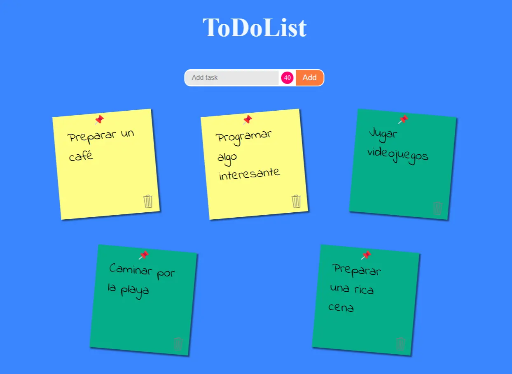

# To-Do List estilo Post-it

Esta es una aplicación simple de lista de tareas estilo Post-it que te permite agregar y eliminar tareas. Las tareas se almacenan localmente en tu navegador a través de LocalStorage. Cada nota tiene un límite de 40 caracteres para mantenerlas breves y concisas.

## Demo

Puedes probar el juego en vivo [aquí](https://to-do-list-seven-eosin.vercel.app/).

## Funcionalidades

- **Agregar Tareas:** Puedes agregar nuevas tareas escribiendo hasta 40 caracteres en el campo de entrada y haciendo clic en el botón "Agregar".

- **Eliminar Tareas:** Para eliminar una tarea, simplemente haz clic en el ícono de papelera junto a la tarea que deseas eliminar.

- **Almacenamiento Local:** Tus tareas se almacenan localmente en tu navegador a través de LocalStorage. Esto significa que tus tareas persistirán incluso después de cerrar la aplicación o el navegador.

- **Contador de caracteres:** En el input de la aplicación, encontrarás un contador que te muestra cuántos caracteres has escrito.

## Problemas y Sugerencias

Si encuentras algún problema o tienes alguna sugerencia, no dudes en abrir un problema en este repositorio.
